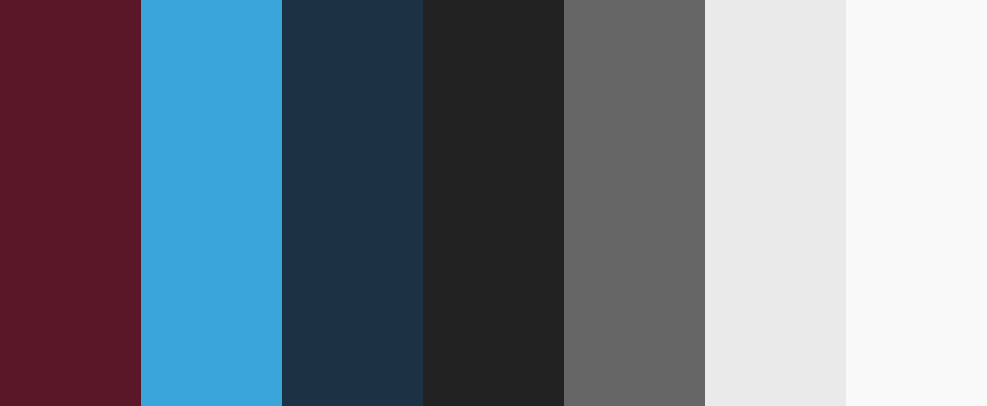

### TODO
```
- Media queries do not work :(
- Coloured cards
```

# The new GUL webpage
Static, simple and following the [material design guidelines](https://material.io/) as much as possible (taking into account we are engineers, not designers).

In each folder there is a README.md file with a bit of information about its contents, TODO notes, and other stuff.

# style.css coding style guide
Each class is a solid block: No space between the name of the class and its attributes,
nor between attributes and comments. Individual classes are divided by one blank line, and the bracket position is always the same. Here are some examples:
```css
header {
    /*Background color*/
    background-color: red;
    background-size: cover;
    /*Set the width to half*/
    width: 50%;
}

column-2 {
    text-size: big;
    text-align: center;
}
```

Big sections are divided by big banners which have a top margin of 2 lines and bottom
margin of one line, like this:
```css
/*Header with a width of 100%...*/
header {
    background-color: red;
    ...
}
...


/*###########################################
##                 COLUMNS                 ##
###########################################*/

/*Second column of the lateral div...*/
column-2 {
    text-size: big;
    ...
}
...
```

One liners are allowed although only for setting one attribute:
```css
/*Deactivate underscoring on all links*/
a {text-decoration: none;}
```


# Design

## Font

The official GUL UC3M font for the logo and most of the printing is done with [Lato](https://fonts.google.com/specimen/Lato), and this page is no exception.

## Color palette

This is the color palette used in the whole page. You can find the hexadecimal values of each one at the beginning of [style.css](style.css)



## Cards

Almost everything in the page is based on cards. They are a simple way of ordering information in blocks and keeping everything tidy.

## Shadows

Thanks to Samuel Thornton, the author of [this Codepen](https://codepen.io/sdthornton/pen/wBZdXq) for the CSS shadow code which really adds for the Material Design experience.